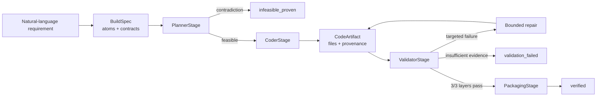

<div align="center">

# Derivative

**A computational invention engine that turns requirements into executable, testable systems.**

[](https://github.com/Daniele-Cangi/Derivative/actions/workflows/forge-ci.yml)
[](https://www.python.org/)
[](LICENSE)
[](https://github.com/Daniele-Cangi/Derivative/releases)
[](https://www.codetriage.com/daniele-cangi/derivative)


</div>

<p align="center">
  
</p>

Derivative and Forge are one system. **Derivative** is the computational reasoning substrate: it combines specialized libraries, deterministic solvers, obligation compilation, contradiction detection, execution, audit, and memory. **Forge** is its software-building pipeline: it turns a natural-language requirement into Python software, runs the generated build in isolation, validates it independently, and packages it only when every gate passes.

```text
requirement -> typed contract -> grounded plan -> generated code
            -> isolated execution -> independent validation
            -> verified package or explicit failure evidence
```

> [!IMPORTANT]
> `verified` does not mean formally proven or universally correct. It means that the generated artifact satisfied the compiled requirement, quality, execution, and adversarial contracts at that revision. Independent blind-oracle acceptance is measured separately.

[Quick start](#quick-start) | [How it works](#how-forge-works) | [Trust model](#trust-model) | [Current scope](#current-scope) | [Evidence](#evidence) | [Documentation](#documentation)

## Quick Start

Prerequisites: Python 3.11 and Docker. Docker is required for production verification of generated code.

```bash
python -m venv .venv
# Windows
.venv\Scripts\activate
# macOS/Linux
source .venv/bin/activate

python -m pip install -r requirements/forge.txt
docker build --file Dockerfile.forge-sandbox --tag derivative-forge-sandbox:py311 .
```

Generate and verify a deterministic artifact without an API key:

```bash
python forge.py "Build a Python CLI that reads a CSV of contracts, extracts expiration dates, flags contracts expiring in less than 90 days, writes a summary CSV, and includes tests."
```

Enable model-backed candidate compilation and repair:

```bash
python -m pip install -r requirements/model.txt
# Set OPENAI_API_KEY in .env
python forge.py "Build a Python REST service with tests." --mode hybrid
```

Host credentials are never inherited by generated-code sandboxes.

## Terminal Results

A normal build reaches one of three terminal build statuses:

- **`verified`**: all runtime, contract, and adversarial gates passed; packaging is allowed.
- **`validation_failed`**: a candidate exists, but its evidence is insufficient; packaging is blocked.
- **`infeasible_proven`**: stated constraints are contradictory and an evidence-backed certificate was emitted.

Operational preflight can stop earlier with explicit errors such as `sandbox_unavailable` or `sandbox_policy_violation`; these do not masquerade as build outcomes.

Failed and infeasible runs preserve their typed artifacts. Only `verified` builds enter `generated_artifacts/forge_packages/`.

## How Forge Works



The stages have deliberately narrow authority:

- `RequirementCompiler` preserves atomic user intent and compiles acceptance, obligation, public-interface, and quality contracts.
- `PlannerStage` uses the Derivative reasoning substrate to produce a typed plan or an infeasibility certificate.
- `CoderStage` expands that plan through certified capability adapters or an allowlisted complete-candidate transaction.
- `ValidatorStage` executes independent checks; generated code cannot self-certify.
- `PackagingStage` runs only after full validation.

The planner cannot decide truth, the coder cannot decide correctness, and the validator cannot redesign the build.

## Trust Model

Forge is designed to fail closed.

1. **Requirement preservation**: hard, ambiguous, and universal requirements remain traceable from source text to plan, files, tests, assertions, and validation evidence.
2. **Quality contracts**: security, persistence, rate limiting, auditability, observability, and test-depth promises become executable obligations.
3. **Isolated execution**: production validation runs in an ephemeral Docker container with no network, a read-only root filesystem, resource limits, and an environment allowlist.
4. **Independent validation**: syntax/import/run, obligations/acceptance, and adversarial checks must all pass.
5. **Bounded repair**: retries target observed failure signatures and must produce a material artifact change before revalidation.
6. **Oracle preflight**: incoherent external benchmark harnesses terminate as `oracle_invalid` before Forge or model execution.

<p align="center">
  
</p>

## Architecture Boundary

Derivative is broader than software generation, while Forge gives that substrate a concrete software-engineering contract. They are connected layers, not two competing agents.

| Layer | Responsibility |
| --- | --- |
| **Derivative** | Computational lenses, deterministic solvers, obligation compilation, execution grounding, contradiction witnesses, audit, and memory |
| **Forge** | Typed software-build contracts, candidate compilation, independent validation, bounded repair, and fail-closed packaging |

Forge reuses Derivative as its truth-producing planning substrate. Derivative can ground a plan or prove a contradiction, but only Forge validation evidence can authorize packaging. Optional model and scientific runtimes load only when the selected mode or problem requires them.

See [Derivative and Forge Architecture Boundary](docs/DERIVATIVE_FORGE_ARCHITECTURE.md).

## Current Scope

**Supported now**

- Greenfield Python CLI, REST service, data pipeline, and library artifacts.
- Deterministic capability profiles with model-backed fallback.
- Typed public module and symbol contracts.
- Requirement-level test and assertion evidence.
- Docker-isolated validation and independent black-box benchmark oracles.
- Explicit infeasibility certificates and invalid-benchmark rejection.

**Not claimed**

- General existing-repository editing.
- Additional programming languages or frontend generation.
- Formal verification of arbitrary software.
- Universal semantic coverage outside implemented contracts.
- Distribution wheels, runtime containers, SBOMs, or supply-chain attestations.

Unsupported or unproven behavior should end as `validation_failed`, never as optimistic packaging.

## Evidence

The current `main` checkpoint passes **548 tests** in Linux/Python 3.11 CI. The complete local Windows run at the same checkpoint reported **546 passed, 2 skipped**. GitHub Actions also runs the minimal-runtime gate and the full Docker-backed 30-case regression gate.

Blind evidence is immutable and reported without retrospective score repair:

- **Blind V5** established the evidence-closure protocol and remains a regression corpus.
- **Blind V6** exposed label and legacy public-import ambiguities; undefined external metrics remain `null`.
- **Blind V7** is the first schema-v3 bundle with typed public import contracts. Its frozen baseline reported external Verified@1 at 0/6. The legacy raw false-verified field was `0.000` with no observed verified artifact; the schema-v3 adjudicated value is therefore `null`, not an asserted 0/0 rate.
- A targeted V7 post-fix replay remained `0/5` externally accepted and exposed one invalid frozen oracle plus four genuine candidate-generation failures. The raw receipt is unchanged; oracle preflight now rejects the broken harness before spending model tokens.

These results show a strong fail-closed architecture, not completed generality. Known blind cases are regression evidence after first execution; future generality must be measured on a newly frozen distribution.

Blind V8 has already been executed and is therefore a known regression corpus. In particular, V8-005 may be replayed for regression diagnosis only and must not be reported as new blind evidence.

The targeted V8-005 replay on `9d2f3a3` reached internal `verified` after one repair and its frozen external oracle passed 12/12. The receipt remains explicitly labeled `post_fix_replay` with `baseline_verified=false`; this is attributable regression evidence, not a new blind result. See [run 33297062090](https://github.com/Daniele-Cangi/Derivative/actions/runs/33297062090).

Blind V9 was independently produced and frozen on `4d8ee7d` before its [first and only baseline](https://github.com/Daniele-Cangi/Derivative/actions/runs/33298884420). The sealed run passed 4/12 cases: status accuracy was 7/12, external Verified@1 was 0/6, external acceptance was 1/6 after repair, false verification was 4/5, and infeasibility detection was 0/3. All three expected `validation_failed` cases remained fail-closed. V9 is now a known regression corpus; these raw results are preserved rather than retrospectively repaired.

A [targeted V9 post-fix replay](https://github.com/Daniele-Cangi/Derivative/actions/runs/33442276463) on `8744f00` exercised five affected known cases. V9-006 passed its frozen oracle 4/4; V9-001, V9-002, V9-003, and V9-005 remained fail-closed, while the two earlier binary-evidence serialization exceptions were eliminated. The receipt is explicitly `post_fix_replay` with `baseline_verified=false`, not new blind evidence.

Full metrics, hashes, denominators, replay labels, and commands are in [Benchmark Evidence](docs/BENCHMARK_EVIDENCE.md).

## Installation Profiles

Install only the capabilities you need:

| Profile | Purpose |
| --- | --- |
| `requirements/forge.txt` | Minimal deterministic Forge host |
| `requirements/model.txt` | OpenAI-backed candidate compilation and repair |
| `requirements/symbolic.txt` | SymPy symbolic reasoning |
| `requirements/topology.txt` | NetworkX graph reasoning |
| `requirements/formal.txt` | Z3 constraint solving |
| `requirements/probabilistic.txt` | pgmpy probabilistic reasoning |
| `requirements/causal.txt` | DoWhy causal reasoning |
| `requirements/quantum.txt` | Qiskit circuit execution |
| `requirements/physical.txt` | SciPy and Pint physical reasoning |
| `requirements/research.txt` | Complete local Derivative substrate |
| `requirements/dev.txt` | Test tooling |
| `requirements/all.txt` | Complete development environment |

`requirements.txt` remains a compatibility alias for `requirements/all.txt`. A missing selected runtime fails explicitly at its capability boundary.

## CLI and Artifacts

```bash
python forge.py --help
python derivative.py --help
python derivative.py --lenses
python derivative.py --audit
python derivative.py --memory
```

Every Forge run writes typed evidence:

```text
generated_artifacts/
|-- forge_runs/<timestamp>_<build-id>_<status>/
|   |-- build_spec.json
|   |-- feasible_plan.json | infeasibility_certificate.json
|   |-- code_artifact.json
|   |-- validation_artifact.json
|   `-- packaged_artifact.json
`-- forge_packages/<package-id>/
    |-- src/
    |-- tests/
    |-- validation_evidence.json
    |-- code_artifact_manifest_dump.json
    `-- forge_package_manifest.json
```

The CLI reports terminal status, executed stages, validation outcome, artifact path, repair count, trace seal, and elapsed time.

## Development

```bash
python -m pip install -r requirements/all.txt
python -B -m pytest -q -p no:cacheprovider tests
```

Build the sandbox before Docker-backed integration and benchmark runs:

```bash
docker build --file Dockerfile.forge-sandbox --tag derivative-forge-sandbox:py311 .
```

The 30-case internal quality gate is a deterministic regression suite, not independent blind proof:

```bash
python forge_benchmark.py --preset extended \
  --execution-backend docker \
  --sandbox-image derivative-forge-sandbox:py311 \
  --enforce-thresholds \
  --min-status-accuracy 0.95 \
  --min-verified-at-1 0.95 \
  --max-false-verified-rate 0.00 \
  --min-infeasible-detection-rate 1.00
```

Evaluation protocols and replay commands are documented in [Benchmark Evidence](docs/BENCHMARK_EVIDENCE.md).

## Documentation

- [Technical Reference](docs/FORGE_TECHNICAL_REFERENCE.md): contracts, capabilities, validation, repair, isolation, dependencies, and artifact schema.
- [Benchmark Evidence](docs/BENCHMARK_EVIDENCE.md): frozen blinds, receipts, metrics, adjudication, and reproducible commands.
- [Architecture Boundary](docs/DERIVATIVE_FORGE_ARCHITECTURE.md): why Forge and Derivative are interconnected and how loading remains capability-driven.
- [Certified Extension Contract](docs/CERTIFIED_EXTENSION_CONTRACT.md): requirements for adding a capability without weakening `verified`.
- [Blind V5 Evidence Closure](docs/FORGE_V5_EVIDENCE_CLOSURE.md): the frozen evidence semantics established at the V5 checkpoint.
- [v0.2.1 Release Notes](https://github.com/Daniele-Cangi/Derivative/releases/tag/v0.2.1): repair-safety and Qiskit runtime-stability checkpoint.
- [Contributing](CONTRIBUTING.md): development workflow and acceptance expectations.
- [MIT License](LICENSE): use and redistribution terms.

## Project Direction

The current phase is deliberately narrow: preserve frozen evidence, correct structural mechanisms rather than known cases, and evaluate the unchanged system on a new blind distribution only after the repair and evidence pipeline is stable.

No new domain, language, frontend, or existing-repository mode is required to close this phase.

## License

Derivative is released under the [MIT License](LICENSE).
