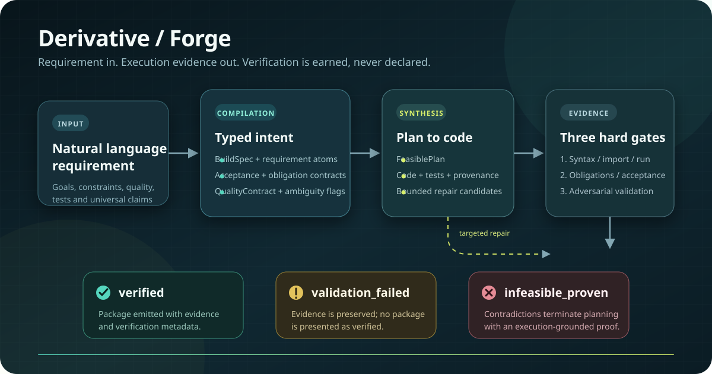
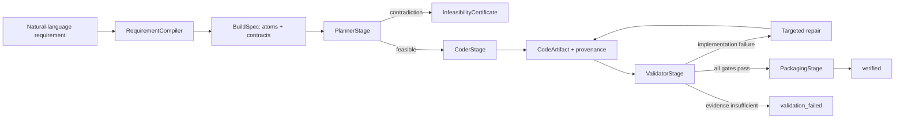
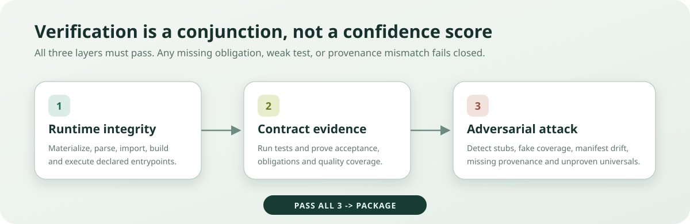

<div align="center">

# Derivative

**Turn software requirements into verified Python artifacts, or explicit failure evidence.**

[](https://github.com/Daniele-Cangi/Derivative/actions/workflows/forge-ci.yml)
[](https://www.python.org/)
[](LICENSE)
[](https://github.com/Daniele-Cangi/Derivative/releases)


</div>

<p align="center">
  
</p>

Derivative is an execution-grounded reasoning and software-synthesis project. Its product-facing **Forge** pipeline compiles a natural-language build requirement into typed contracts, plans and generates code, executes it inside a constrained environment, validates independent evidence, and packages only artifacts that pass every gate.

> [!IMPORTANT]
> Forge does not treat model confidence or generated test presence as proof. `verified` means the artifact satisfied the compiled internal requirement, quality, execution and adversarial contracts. Independent blind-oracle acceptance is reported separately. Neither status is a proof of universal correctness or of properties absent from the requirement.

**Navigate:** [Quick start](#quick-start) · [How Forge works](#how-forge-works) · [Validation](#validation-layers) · [Isolation](#execution-isolation) · [Supported surface](#scope-and-maturity) · [Evidence](#current-verification-status) · [Contributing](#contributing-and-certified-extensions)

## At a Glance

| Entry point | Use it for | Result |
| --- | --- | --- |
| `python forge.py "..."` | Building a new Python CLI, service, pipeline or library from a software requirement | Verified package, validation evidence, or infeasibility certificate |
| `python derivative.py "..."` | Symbolic, probabilistic, topological, causal and constraint-grounded reasoning | Executed reasoning result plus audit artifacts |

**Current Forge surface:** `Python 3.11` · `greenfield` · `CLI` · `REST service` · `data pipeline` · `library` · `Docker-isolated validation`

**Explicitly deferred:** existing-repository modification, additional languages, frontend generation, wheel/container distribution, SBOMs and supply-chain attestations.

Forge has three terminal outcomes:

- **`verified`**: all runtime, contract and adversarial gates passed; packaging is allowed.
- **`validation_failed`**: a candidate exists, but the evidence is insufficient; packaging is blocked.
- **`infeasible_proven`**: planning found contradictory constraints and emitted an execution-grounded certificate.

## Quick Start

Prerequisites: Python 3.11 and Docker. Docker is mandatory for production verification of generated code.

```bash
python -m venv .venv
# Windows: .venv\Scripts\activate
# macOS/Linux: source .venv/bin/activate
python -m pip install -r requirements/forge.txt
docker build --file Dockerfile.forge-sandbox --tag derivative-forge-sandbox:py311 .
```

Run the deterministic, no-API path:

```bash
python forge.py "Build a Python CLI that reads a CSV of contracts, extracts expiration dates, flags contracts expiring in less than 90 days, writes a summary CSV, and includes tests."
```

Forge reports one terminal status, a five-stage evidence rail, and a trace seal derived from the actual code digest, infeasibility certificate, or retained validation failures:

```text
       *
  ===========
  \====*====/  FORGE // DERIVATIVE
      ||       EXECUTION-GROUNDED BUILD
     /__\      REQUIREMENT > EVIDENCE > ARTIFACT

EVIDENCE RAIL
       + -------- + -------- + -------- + -------- #
    COMPILE     PLAN     GENERATE   VALIDATE   PACKAGE

  01  COMPILE   PASS    requirement contract preserved
  02  PLAN      PASS    feasible architecture grounded
  03  GENERATE  PASS    candidate artifact emitted
  04  VALIDATE  PASS    3/3 evidence layers passed
  05  PACKAGE   SEALED  verified artifact packaged

Status: verified
Requirement compiled, generated, executed and validated across all three layers.

Trace seal: code:...
Attempts: planner 1 | validation 1 | repairs 0
Packaged artifact: generated_artifacts/forge_packages/pkg-...
Execution time: ...s
```

For model-backed candidate compilation and repair, install the model profile, copy `.env.example` to `.env`, set `OPENAI_API_KEY`, then use `--mode hybrid`. Secrets are used by the host orchestrator and are not inherited by generated-code sandboxes.

```bash
python -m pip install -r requirements/model.txt
python forge.py "Build a Python REST service with tests." --mode hybrid
```

## How Forge Works



The critical separation is deliberate: the planner cannot decide truth, generated code cannot self-certify, and the validator cannot redesign the build. Validator evidence alone controls retry, rejection and packaging.

Derivative and Forge share one truth-producing substrate but have different responsibilities: Derivative supplies computational lenses, execution grounding, obligations, contradiction witnesses, audit and memory; Forge supplies typed software-build contracts, candidate expansion, independent validation, bounded repair and fail-closed packaging. The detailed boundary and selective runtime-loading work are documented in [Derivative and Forge Architecture Boundary](docs/DERIVATIVE_FORGE_ARCHITECTURE.md).

The Forge composition root and shared model boundary are lazy: importing `forge`, displaying CLI help, or constructing a local-only planner does not load OpenAI or optional scientific lens runtimes. A planning run preserves all seven Derivative lenses while activating OpenAI, SymPy, Qiskit, Z3, SciPy/Pint, NetworkX, and other model, lens, or solver runtimes only when the selected execution mode or problem signals require them. Installation extras are the next dependency boundary.

## Core Modules

### Derivative substrate
- `core/substrate.py`: cognitive framing with installed computational lenses.
- `core/kernel.py`: synthesis over framings with execution grounding.
- `core/execution_loop.py`: code execution loop, contradiction/infeasibility handling.
- `core/obligation_compiler.py`: obligation schema extraction/evaluation.
- `audit/trail.py`: persistent audit trail.
- `memory/delta.py`, `memory/gene_pool.py`: memory + lineage persistence.
- `core/workspace.py`: artifact emission/export.

### Forge pipeline
- `core/forge/contracts.py`: typed build, plan, code, validation, quality, and packaging contracts.
- `core/forge/requirement_compiler.py`
- `core/forge/planner_stage.py`
- `core/forge/coder_stage.py`: thin plan-to-artifact facade.
- `core/forge/candidate_compiler.py`: OpenAI-backed complete-candidate fallback for uncovered plan capabilities.
- `core/forge/candidate_preflight.py`: executable and semantic preflight for complete candidate transactions.
- `core/forge/semantic_contracts.py`, `test_evidence.py`, `requirement_evidence.py`: requirement-specific behavioral and assertion evidence.
- `core/forge/repair.py`, `repair_evidence.py`, `repair_backend.py`: validator-grounded repair targeting and bounded revision.
- `core/forge/execution.py`: typed local/Docker process boundary and resource policy.
- `core/forge/domains/`: deterministic CLI, service, and pipeline code-generation adapters plus registry.
- `core/forge/capabilities/`: composable capability renderers used by domain adapters.
- `core/forge/validator_stage.py`: thin validation orchestration facade.
- `core/forge/validation/`: runtime, obligation, capability-contract, quality-contract, and adversarial validation components.
- `core/forge/packaging_stage.py`
- `forge.py` (thin orchestrator)

## Libraries

Libraries are permanent computational lenses at substrate level, not names placed in a prompt. `CognitiveSubstrate` loads the causal, symbolic, topological, probabilistic, quantum, formal, and physical lenses at startup; deterministic solvers and generated executable checks then ground their claims.

| Package | Substrate role |
| --- | --- |
| `sympy` | Symbolic algebra, linear recurrence solving, limits, and closed-form obligation checks |
| `networkx` | Exact graph enumeration, connectivity, topology metrics, and structural witnesses |
| `qiskit`, `qiskit-aer` | Quantum circuit construction and executable circuit-backed checks |
| `z3-solver` | Satisfiability checks and formal contradiction witnesses |
| `pgmpy` | Probabilistic-model lens support |
| `dowhy` | Causal-model lens support |
| `scipy`, `pint` | Scientific and unit-aware physical reasoning support |
| `openai` | Complete-candidate compilation and targeted repair in `hybrid`/`remote-only`; never the final validator |
| `pytest` | Generated acceptance tests and independent benchmark-oracle execution |
| `typer`, `rich`, `python-dotenv` | CLI, structured output, and host-side configuration |
| `bcrypt` | Certified sandbox dependency for hashed-auth service contracts |

Missing solver libraries degrade or block the corresponding lens; Forge does not silently replace a required deterministic capability with model narration.

## Dependency Profiles

Dependencies follow the same capability boundary as the runtime. Install only the profiles needed by the selected execution path:

| Profile | Installs |
| --- | --- |
| `requirements/forge.txt` | Minimal deterministic Forge host: Typer, Rich presentation, and environment loading |
| `requirements/model.txt` | OpenAI-backed `hybrid` and `remote-only` execution |
| `requirements/symbolic.txt` | SymPy symbolic capability |
| `requirements/topology.txt` | NetworkX topology capability |
| `requirements/formal.txt` | Z3 formal capability |
| `requirements/probabilistic.txt` | pgmpy probabilistic capability |
| `requirements/causal.txt` | DoWhy causal capability |
| `requirements/quantum.txt` | Qiskit circuit and simulator capability |
| `requirements/physical.txt` | SciPy/Pint physical and unit-aware capability |
| `requirements/research.txt` | Complete local-only Derivative substrate and CLI |
| `requirements/dev.txt` | Repository test runner |
| `requirements/all.txt` | Complete research, model, and development environment |

Profiles are composable. For example, a local Forge installation with exact symbolic support uses:

```bash
python -m pip install -r requirements/forge.txt -r requirements/symbolic.txt
```

`requirements.txt` remains a backward-compatible alias of `requirements/all.txt`. Missing selected runtimes fail explicitly at their execution boundary; importing or constructing unrelated capabilities does not install, import, or emulate them.

CI enforces both sides of this boundary independently: one clean job installs only `requirements/forge.txt` and executes import, local planning, and CLI-startup smoke checks; the full gate installs `requirements/all.txt` before running the complete suite and benchmark thresholds.

## Requirement Preservation and Coverage Gate

Forge preserves atomic requirement units end-to-end.

### Requirement atoms
Each requirement is compiled into typed atoms with:
- stable `requirement_id`
- `text`
- `category` (`functional`, `non_functional`, `quality`, `validation`, `universal_constraint`, `ambiguity`)
- `strength` (`hard`, `soft`, `universal`, `ambiguous`)
- `source_fragment`

### Propagation
- `BuildSpec.requirement_atoms` carries atomic requirements.
- `AcceptanceCriterion.requirement_ids` links acceptance to atoms.
- `FeasiblePlan.requirement_coverage` maps each requirement to files/tests/acceptance.
- `PlanTest.requirement_ids` keeps test-to-requirement traceability.
- `CodeArtifact` provenance includes `requirement:<id>` tags.

## Quality Contracts and Domain Adapters

`RequirementCompiler` extracts a typed `QualityContract` for security, rate limiting, persistence, auditability, observability, and test depth. The contract is propagated through planning, recorded in the artifact manifest, and checked against generated source and executed tests before verification.

`CoderStage` selects a domain adapter from typed plan structure, never from evolutionary seeds or freeform generation state. Current adapters are:
- `cli`
- `service`
- `pipeline`
- `library`

The adapters are split into narrow domain profiles rather than one growing template. Current deterministic profiles include CSV business CLIs, JSON log and merge CLIs, scored-record JSON sorting, event services, telemetry/sales/JSONL pipelines, email normalization, largest-remainder allocation, Semantic Versioning precedence, and interval merging. Plans outside implemented capability profiles remain fail-closed locally and may use the complete Candidate Compiler transaction in `hybrid` or `remote-only` mode.

The selected adapter is recorded in `artifact_manifest.metadata.domain_adapter`. New domains must implement the same deterministic adapter contract instead of adding branches to `CoderStage`.

Each adapter also declares the concrete capabilities it implements. The obligation layer derives required capabilities from hard requirement atoms and compares them with the selected adapter independently of the artifact manifest. A target label such as `CLI` is therefore insufficient to certify an unrelated template; missing capabilities fail with `adapter_capability_mismatch`, while forged or stale manifest declarations fail with `adapter_capability_manifest_mismatch`.

When a deterministic adapter lacks required capabilities, `hybrid` and `remote-only` modes can route the typed plan to the Candidate Compiler. It must replace every planned source and test file as one allowlisted transaction; omitted files, extra paths, failed executable/semantic preflight, stale digests, or provenance mismatches reject the whole candidate. Manifest capability declarations, SHA-256 digests, transaction lineage, and provenance are rebuilt locally rather than accepted from model output. `local-only` never invokes this fallback and remains fail-closed.

## Capability Composition

For service builds, `PlannerStage` compiles a typed `ImplementationBlueprint` made of `CapabilitySpec` records. Each capability declares its module path, interfaces, dependencies, linked requirement IDs, quality fields, and deterministic configuration.

The service adapter composes these capabilities into separate modules:
- API and entrypoint (`src/service.py`)
- request workflow (`src/domain.py`)
- persistence (`src/storage.py`)
- authentication (`src/auth.py`)
- rate limiting (`src/rate_limit.py`)
- audit trail (`src/audit.py`)
- observability (`src/observability.py`)

Generated-file provenance records the producing capability, its dependencies, requirement IDs, and quality fields. The capability contract gate rejects missing modules, invalid dependency imports, blueprint/manifest drift, or provenance mismatches with `missing_capability` or `capability_contract_violation`.

### Validator hard gates
Validation fails closed if:
- an atomic requirement is omitted downstream (`semantic_omission`)
- requirement coverage is missing (`missing_requirement_coverage`)
- a universal/absolute constraint is unproven (`universal_constraint_unproven`)
- a planned capability is absent or inconsistent (`missing_capability`, `capability_contract_violation`)
- the selected domain adapter cannot implement the required behavior (`adapter_capability_mismatch`)
- tests are superficial/non-semantic (`non_semantic_test`, `fake_acceptance_coverage`)
- a mapped test lacks an assertion causally tied to the same requirement signals (`missing_requirement_assertion_evidence`)

## Validation Layers

`ValidatorStage` composes independent runtime, obligation, quality, and adversarial components and enforces 3 layers:

<p align="center">
  
</p>

1. syntax/import/build/run checks
2. obligations/tests/acceptance checks
3. adversarial checks (manifest/provenance/entrypoint/superficiality)

A build is verified only if all 3 layers pass.

## Failure-Guided Repair

Coder retries are grounded in `ValidationArtifact` failure signatures and evidence. Forge compiles a typed repair directive, records target files and operations, and accepts a revised `CodeArtifact` only when its source, tests, manifest, or provenance actually changes. Requirement-assertion failures compile into path/function-level targets containing the exact requirement ids, causal test functions, existing assertions, and missing evidence terms; test-only failures do not trigger unrelated candidate regeneration. A repair that is unsupported, not applicable, or byte-equivalent terminates as `validation_failed`; it cannot consume a synthetic retry or reach packaging.

In `hybrid` or `remote-only` mode, Forge may ask the existing cognitive substrate and reasoning kernel for complete replacements of validator-targeted files. These revisions are untrusted candidates: path allowlists prevent unplanned file or manifest changes, repair lineage is persisted, and all three validation layers must pass again before packaging. `local-only` remains deterministic and uses canonical plan regeneration without requiring a remote model.

For an uncovered capability, Forge uses the stricter complete Candidate Compiler transaction instead of a partial repair. Preflight executes all generated tests and checks mapped semantic evidence before the candidate reaches `ValidatorStage`. Requirement evidence is tracked at test-function and assertion level, including the assertion line, expression, and semantic terms it covers; a term elsewhere in the file cannot certify an unrelated assertion. The validator remains the final authority and can still reject the candidate. Repository-held acceptance oracles are used only by the held-out benchmark and are never exposed to generation.

## Oracle Contract Preflight

Blind evidence is accepted only when the external oracle is coherent with the frozen requirement. Before Forge spends model tokens or generates a candidate, the benchmark runner checks executable acceptance fixtures against explicit contracts such as quoted regular expressions and finite Unicode/cardinality witnesses.

An inconsistent benchmark terminates as benchmark-only `oracle_invalid`. That status is not converted to `validation_failed`, `infeasible_proven`, or a passing score, and Forge execution is skipped. The frozen requirement and oracle remain unchanged; the mismatch and source location are persisted as adjudication evidence.

## CLI Reference

### Derivative CLI
```bash
python derivative.py --help
python derivative.py "Given a problem statement..."
python derivative.py --audit
python derivative.py --memory
python derivative.py --lenses
```

### Forge CLI
```bash
python forge.py --help
python forge.py "Build a Python CLI that reads a CSV of contracts, extracts expiration dates, flags contracts expiring in less than 90 days, writes a summary CSV, and includes tests."
```

Forge defaults to `--mode local-only` for deterministic compilation and to `--execution-backend docker` for isolated verification. `hybrid` enables model-backed fallback after deterministic capability routing; `remote-only` forces model-backed reasoning where the substrate supports it. Production orchestration refuses a non-isolated verification backend.

Expected output style is prose and always includes:
- terminal `Status`
- what executed/passed/failed
- artifact path
- execution time

## Generated Artifacts

Every run preserves its typed evidence, including failed and infeasible runs. Only verified builds appear under `forge_packages`.

```text
generated_artifacts/
├── forge_runs/<timestamp>_<build-id>_<status>/
│   ├── build_spec.json
│   ├── feasible_plan.json | infeasibility_certificate.json
│   ├── code_artifact.json
│   ├── validation_artifact.json
│   └── packaged_artifact.json
└── forge_packages/<package-id>/
    ├── src/
    ├── tests/
    ├── validation_evidence.json
    ├── code_artifact_manifest_dump.json
    └── forge_package_manifest.json
```

## Configuration

Installation and sandbox build commands are in [Quick Start](#quick-start).

Live `hybrid` and `remote-only` reasoning use the OpenAI Responses API. Configure:

```dotenv
OPENAI_API_KEY="your-api-key-here"
OPENAI_MODEL="gpt-4.1-mini"
```

`local-only` does not require an API key.

## Documentation Map

- [Contributing guide](CONTRIBUTING.md): development workflow and acceptance expectations.
- [Certified Extension Contract](docs/CERTIFIED_EXTENSION_CONTRACT.md): requirements for adding capabilities without weakening `verified`.
- [Derivative and Forge Architecture Boundary](docs/DERIVATIVE_FORGE_ARCHITECTURE.md): why Forge uses the Derivative substrate and how capability-driven lazy loading reduces startup and installation dependencies after the V5 freeze.
- [Forge Evidence Closure - Blind V5](docs/FORGE_V5_EVIDENCE_CLOSURE.md): immutable baseline semantics, attributable replay receipts, and the next independent evaluation contract.
- [Blind evaluation protocol](benchmarks/blind_v3/README.md): freeze, provenance and replay rules for independent evaluation.
- [Blind-v5 manifest](benchmarks/blind_v5/external_001/manifest.json): current frozen requirements, oracle digests, provenance, and protected baseline.
- [Blind-v5 immutable baseline](benchmarks/blind_v5/external_001/baseline_result.json): first-run result before regression work.
- [Blind-v6 manifest](benchmarks/blind_v6/external_001/manifest.json): independently produced schema-v2 bundle sealed before its only baseline execution.
- [Blind-v6 immutable baseline](benchmarks/blind_v6/external_001/baseline_result.json): unadjusted first-run metrics and case evidence.
- [Blind-v6 label adjudication](benchmarks/blind_v6/external_001/requirement_adjudication.json): two-model review performed without Forge results.
- [Blind-v6 adjudicated metrics](benchmarks/blind_v6/external_001/adjudicated_metrics.json): append-only derived receipt with explicit exclusions and denominators.
- [Forge CI workflow](.github/workflows/forge-ci.yml): the Linux/Docker test and benchmark gate executed on every push and pull request.
- [Release v0.1.0](https://github.com/Daniele-Cangi/Derivative/releases/tag/v0.1.0): first public release snapshot.
- [MIT License](LICENSE): usage and redistribution terms.

## Contributing and Certified Extensions

Derivative welcomes contributions that expand the verified surface without weakening the meaning of `verified`. A new renderer, adapter, prompt, or passing generated test suite is not sufficient on its own: an extension must preserve typed requirement intent, capability declarations, independent validation, provenance, and appropriate evaluation evidence.

Start with [`CONTRIBUTING.md`](CONTRIBUTING.md). If the contribution adds a new software domain, capability family, or verification primitive, also read the [`Certified Extension Contract`](docs/CERTIFIED_EXTENSION_CONTRACT.md).

The preferred direction is **incremental certification**, not one universal adapter. Unsupported semantics should continue to fail closed until the project has a defensible verification contract for them. Historical blind reports and frozen benchmark inputs remain evidence; changes after an observed blind case are regression work and must not be presented as fresh blind results.

## License

Derivative is released under the [MIT License](LICENSE).

## Current Verification Status

Evidence is reported by revision and evaluation type. Targeted post-fix replays are regression evidence, never retroactively promoted to a fresh blind aggregate.

- The current adjudicated-metrics checkpoint reports **442 passed, 2 skipped** locally and passes the GitHub Actions Docker sandbox and internal regression gate.
- The 30-case gate remains useful for deterministic CI regression, but it is not presented as independent blind proof because its cases are repository-maintained.
- Blind V5 was frozen before first execution. Its immutable baseline scored **4/12**, status accuracy **0.417**, external false-verified rate **1.000**, infeasibility detection **0.333**, 680,399 model tokens, and an estimated cost of $1.83934.
- Structural fixes are measured through isolated, explicitly labeled post-fix replays. There is intentionally no synthetic "current V5 score" assembled from runs made at different revisions.

### Blind V6 evidence

Blind V6 was produced outside the Forge execution path, frozen before its first run, and executed once against its sealed baseline. The immutable raw report remains unchanged: 12 cases, status accuracy 0.333, external `Verified@1` 0.000, external false-verified rate 1.000, infeasibility detection 0.000, 743,949 model tokens, and $1.885866 estimated model cost.

The later requirement-label adjudication did not receive Forge output, generated code, failure signatures, oracle results, or the baseline report. Two distinct models agreed on six valid labels and three corrected labels, and disagreed on three cases. A deterministic post-check independently rejects the reviewer consensus for V6-007 because its five-item input example returns four items despite a same-length requirement. The append-only adjudicated receipt therefore includes eight cases in status metrics, excludes three unresolved cases plus V6-007, and reports adjudicated status accuracy 3/8 (0.375).

V6 predates the typed public import contract introduced in blind schema v3. Consequently none of its verified cases has both a frozen oracle and a schema-v3 `public_contract`; definitive external `Verified@1`, oracle pass, repair success, false-verified, and infeasibility rates are recorded as `null`, not zero. This prevents a legacy oracle import assumption from being reported as either Forge success or Forge failure. The raw report, adjudication receipt, and derived metrics remain separate hashed evidence sources.

The derived receipt SHA-256 is `8D7CF76BF927CC86CA3523762C920B8489D631888F2F7260974AA49135AEF96C`; its embedded baseline-report and adjudication-receipt hashes both match the immutable source files.

### Blind V7 evidence

Blind V7 is the first schema-v3 evaluation. An isolated `gpt-4.1` producer created 12 new cases with exact typed public import contracts, separate requirement and oracle reviews, and no Forge source or prior blind case in its prompts. The bundle was sealed before execution with manifest SHA-256 `F84222978A21DC38C2534BE7BEF29A7A2F94BE0BE36CAA8E2AA6B8DF761CC80E`, dataset SHA-256 `DE39E16364468F727C7685823359B3945448AC82BB8A3C50A1E47EE27EBA7920`, and protected Forge baseline SHA-256 `9EA720203B0FC6D07831F4DEAD08A351DC94C2991E04E280FD1541596BD45E22`.

The [first and only baseline run](https://github.com/Daniele-Cangi/Derivative/actions/runs/32532939841) completed in Docker against the verified baseline. The immutable raw report records 4/12 matching claimed statuses, status accuracy 0.333, external `Verified@1` 0.000, success after repair 0.000, external false-verified rate 0.000, and infeasibility detection 0.333. It used 54 model requests, 761,049 tokens, 17 repairs, and $2.048034 estimated model cost; median case latency was 124.91 seconds and P95 was 245.62 seconds. Workflow success means the measurement completed, not that Forge passed the benchmark.

The independent requirement-label adjudication received no Forge outputs, generated code, failure signatures, oracle results, or baseline report. Two reviewers agreed that five labels were valid, six were invalid, and one was unresolved. All six corrected labels are `verified`: three supposed Unicode ambiguities were objectively specified by the requirement, while three impossible filtering predicates still define feasible programs whose valid result is always empty. The append-only derived receipt therefore includes 11 cases, excludes the unresolved case, and reports adjudicated status accuracy 0/11. External `Verified@1` and external success after repair are both 0/5. External false-verified rate, oracle pass rate, and infeasibility detection are `null` because their adjudicated denominators are zero; they are not reported as synthetic zeros.

The dominant structural failure is not the schema-v3 public contract. In five objectively feasible CLI cases, module imports and generated tests passed, but ValidatorStage's generic smoke invocation supplied both input and output file arguments to a declared `main(argv)` contract that allowed zero or one positional filename. The entrypoints correctly rejected the extra argument, and the validator classified the run as `import_failure` even though `imports_ok=true`. This is a verification-contract mismatch and failure-signature classification defect. V7 is now frozen as evidence; any correction is measured only as an explicitly labeled replay and must generalize from the declared interface rather than special-case these tasks.

The raw [baseline report](benchmarks/blind_v7/external_001/baseline_result.json), independent [label adjudication](benchmarks/blind_v7/external_001/requirement_adjudication.json), and [adjudicated metrics](benchmarks/blind_v7/external_001/adjudicated_metrics.json) remain separate linked receipts. Their SHA-256 values are respectively `C571B8E4891C9CC45B69BAF63DACE6A00FB8B9A2DCB468DBE4BC107451FC2F9D`, `1461B0719315EE41244B271C0C2371E5BB46A53AF5BF5E1797B1BC2C45B0A8CB`, and `F11218B6B3B41CC0D3BDE191BEE6579EF97BD14F676F89D537935EC15BBD51E6`.


### Blind V5 regression ledger

| Evidence | Result | Interpretation |
| --- | --- | --- |
| `V5-002` | `verified` after one repair; independent oracle 7/7 | Valid feasible regression; 64,234 tokens, four model requests, external false-verified rate 0.000 |
| `V5-005` | `verified`; independent oracle passed | Valid feasible evidence on the frozen contract |
| `V5-010`, `V5-012` | `infeasible_proven` | Contradiction routing remained terminal and fail-closed |
| `V5-001` | `oracle_invalid` before Forge execution | Frozen oracle supplied process-style `argv[0]` to an importable `main(argv)` contract |
| `V5-003` | `oracle_invalid` before Forge execution | Universal Unicode case inversion contradicted the fixed-length output contract (`İ` is a finite witness) |
| `V5-004` | `oracle_invalid` before Forge execution | Frozen invalid fixture contradicted its own explicit regex; replay used zero model calls/tokens |
| `V5-006` | `verified` after two repairs; independent oracle 9/9 | Library-only target, conditional requirements, missing-field `None` semantics, and forbidden CLI/service evidence are preserved end to end; 116,861 tokens, $0.304336 estimated cost, 190.22s, external false-verified rate 0.000 |

The complete immutable reports are stored beside the V5 manifest as `baseline_result.json` and `post_fix_replay_*.json`. Oracle-invalid findings are exclusions with evidence, not passes.

<details>
<summary><strong>Historical blind-v2/v3 replay ledger</strong> (run IDs, raw metrics, known oracle defects)</summary>

The original sealed blind-v2 run is preserved unchanged and scored 6/10 with an external false-verified rate of 0.0. Later post-fix replays and targeted oracle runs are regression evidence, not new blind evidence, because those requirements are now known to the development process. The latest targeted rerun of the three previously failing feasible cases (`B001`, `B004`, and `B005`) passed 3/3 with all external oracles, but this must not be reported as a fresh blind 10/10 result.

Blind-v3 run `31877186602` is the first execution of `external_002`; two preceding workflow runs failed integrity preflight and executed no cases. The blind result exposes structural gaps in atomic requirement extraction, domain routing, semantic test alignment, and general contradiction detection. Fixes after this point are evaluated only as regression replays against the unchanged bundle. The original report is stored at `benchmarks/blind_v3/external_002/baseline_result.json`.

Post-fix replay `31879547356` is explicitly labeled `post_fix_replay` with `baseline_verified=false`. It improved the unchanged suite to 6/12, reduced external false-verified rate from 1.000 to 0.000, and raised infeasibility detection from 0.000 to 1.000. External Verified@1 and oracle pass rate remained 0.000 because all six feasible cases still failed closed. The replay used `local-only` mode and zero model calls, so the remaining measured bottleneck is feasible candidate generation beyond the deterministic adapters, not truth-gate permissiveness. Its report is stored at `benchmarks/blind_v3/external_002/post_fix_replay_001.json`.

Model-backed replay `31879929684` is also labeled `post_fix_replay` with `baseline_verified=false`. It produced 6/12 passing cases and status accuracy 0.583, while preserving infeasibility detection at 1.000. One feasible build was internally certified but failed its independent oracle because the generated package did not preserve the requested public module path; external false-verified rate was therefore 1.000, external `Verified@1` and oracle pass rate were 0.000, and no repair succeeded externally. The run used 38 model requests and 347,287 tokens, with median case latency 41.55 seconds and P95 latency 185.28 seconds. Estimated model cost is unavailable because pricing metadata was not configured. The result identifies interface-to-package traceability and verification-contract granularity as the next structural work; it does not establish a better blind score. Its report is stored at `benchmarks/blind_v3/external_002/post_fix_replay_002_hybrid.json`.

Model-backed replay `31882743848` evaluated the same sealed bundle after adding typed public-module contracts, structural entrypoint evidence, property-oriented universal checks, and capability-based candidate routing. It produced 6/12 passing cases, raised status accuracy to 0.833, preserved infeasibility detection at 1.000, and passed one of the five external oracles that executed, including the previously failing `service.hash_stream` contract. External `Verified@1` remained 0.000 because every internally verified feasible build required repair; success after repair was 0.167 and oracle pass rate was 0.200. Five of six internally verified builds still failed either an oracle or the expected terminal status, so external false-verified rate improved only to 0.833. The remaining failures expose a general public-name extraction gap for library functions, components, CLI tools, and standalone functions, plus an unmaterialized ambiguity for unspecified pseudo-random algorithms. The run used 32 model requests, 299,800 tokens, and 11 repairs, with median case latency 44.79 seconds and P95 latency 240.55 seconds. Its immutable report is stored at `benchmarks/blind_v3/external_002/post_fix_replay_003_hybrid.json`.

Model-backed replay `31885082173` evaluated the same sealed bundle after generalizing declared public names and treating unspecified seeded pseudo-random output as materially ambiguous. It produced 6/12 passing cases, status accuracy 0.667, external `Verified@1` 0.000, success after repair 0.333, oracle pass rate 0.500, external false-verified rate 0.667, and infeasibility detection 1.000. The `invert_dictionary` and `filter_by_predicate` artifacts now pass their independent oracles, and the pseudo-random CLI now fails closed as expected. Two ambiguity-heavy cases still became false `verified` because explicit terms such as `unprovable` and `inherently ambiguous` were not materialized. The `service.hash_stream` case exposed an adapter-precedence collision between a typed library target and a module named `service`. Two remaining oracle failures also reveal frozen oracle defects: V3-005 over-specifies process-exit behavior and its stdout fixture does not capture the implementation output under pytest, while V3-006 simultaneously comments `0d` as allowed and asserts that it must raise. These oracle files remain unchanged. The run used 30 model requests, 264,277 tokens, and 9 repairs, with median case latency 46.64 seconds and P95 latency 138.25 seconds. Its immutable report is stored at `benchmarks/blind_v3/external_002/post_fix_replay_004_hybrid.json`.

Model-backed replay `31887238434` evaluated the unchanged sealed bundle after typed-target adapter precedence, blueprint-aware pipeline selection, explicit ambiguity preservation, and normative `must`/`must not` requirement classification. It produced 7/12 passing cases and status accuracy 0.583. External `Verified@1` remained 0.000, success after repair was 0.167, external false-verified rate reached 0.000, and infeasibility detection remained 1.000. The only internally verified feasible artifact was `service.hash_stream`; it passed all five tests in its independent oracle, so the oracle pass rate among executed oracles was 1.000. The explicitly underspecified cases V3-007, V3-008, and V3-009 all failed closed as expected. Five other feasible cases remained `validation_failed`, primarily with capability mismatch, semantic coverage, non-semantic test, superficial stub, or no-change repair evidence. This is a safety improvement but a feasible-generation regression: only one of six expected feasible cases reached external verification. The run used 35 model requests, 328,053 tokens, and 11 repairs, with median case latency 50.94 seconds and P95 latency 95.47 seconds. Estimated model cost remained unavailable because pricing metadata was not configured. Its immutable report is stored at `benchmarks/blind_v3/external_002/post_fix_replay_005_hybrid.json` with SHA-256 `472441EE52F89CBD1BFE6C44FAE1BD00DBECE99BA011E6101ACFC975F9FA9FDC`.

Model-backed replay `31892238379` evaluated the same frozen bundle after grounding candidate correction in complete preserved-file context, sharing anti-stub semantics between preflight and validation, carrying typed requirement and symbol scope into repair, setting the source-layout import path during test execution, and recording post-repair validation deltas. All 12 terminal statuses matched: the six feasible cases reached internal `verified`, V3-007 through V3-009 failed closed, and V3-010 through V3-012 remained `infeasible_proven`. The unadjusted external report records 9/12 passing cases, external `Verified@1` 0.000, success after repair 0.500, oracle pass rate 0.500, external false-verified rate 0.500, and infeasibility detection 1.000. It used 30 model requests, 260,543 tokens, and 9 repairs, with median latency 49.74 seconds and P95 latency 91.85 seconds; cost remained unavailable.

The three external failures require explicit oracle adjudication rather than silent metric adjustment. V3-005 and V3-006 retain the previously documented frozen-oracle contradictions. V3-001 also has an oracle defect: the generated `dupfilter.main()` returns `1` for invalid UTF-8 and its executable entrypoint calls `sys.exit(main())`; direct subprocess execution returns status `1`. The oracle calls `main()` directly but discards that return value and records success unless `main()` raises. The raw report and false-verified rate remain unchanged for auditability, so this replay is regression evidence, not proof that the external closure criterion has been met. One generated acceptance test also contained a tautological integer assertion, exposing a remaining general anti-stub/evidence-quality gap even though it was not the cause of the V3-001 oracle failure. The immutable report is stored at `benchmarks/blind_v3/external_002/post_fix_replay_006_hybrid.json` with SHA-256 `9688279A954BFB5EB72B49FC46363F5AA171E34821BE0BD0C47EBF568EBE7584`.

The blind manifest keeps the original expected Forge baseline digest and file count. Reports expose both expected and currently observed baseline metadata; any implementation change keeps `baseline_verified=false` unless the exact sealed implementation is used. The baseline is never silently resealed.

</details>

## Scope and Maturity

Forge is currently an advanced Python software-synthesis system, not yet a general-purpose repository coding agent.

Strongest supported areas:

- greenfield Python CLI, service, pipeline, and library artifacts;
- requirement preservation and executable acceptance coverage;
- deterministic domain profiles with model-backed fallback;
- conservative validation and explicit infeasibility proofs;
- audit, provenance, repair lineage, and verified packaging.

Current boundaries:

- modifying large existing repositories is not yet a first-class workflow;
- unknown domains still depend on model-generated complete candidate transactions;
- generated code execution is routed through a typed policy boundary; production Forge runs require the Docker sandbox, while the local backend is restricted to trusted tests and cannot produce a verified package through `run_forge`;
- packaging does not yet provide wheels, containers, lockfiles, SBOMs, or supply-chain attestations;
- semantic evidence combines execution with typed, AST, and domain-specific checks and therefore remains incomplete outside covered contracts;
- current public benchmarks are regression suites once their requirements have been used for implementation fixes.

## Development Roadmap

Blind V7 is frozen as the first schema-v3 evidence snapshot and is not retained as an optimization target. Forge remains focused on its existing Python CLI, service, pipeline, and library surface while structural replay work addresses only verification-contract defects exposed by independent evidence.

Post-freeze priorities:

1. Preserve every V5/V6/V7 baseline, replay, adjudication, invalid-benchmark finding, token count, cost, latency, repair count, and artifact digest without rewriting raw evidence.
2. Keep raw metrics, model-based label adjudication, deterministic sanity checks, and derived definitive metrics as separate linked receipts.
3. Keep future blinds on schema v3, frozen before Forge sees their requirements or oracles; every case must declare a typed public import contract and every oracle must import it exactly.
4. Report Verified@1, success after repair, external acceptance, false verification, infeasibility detection, invalid-benchmark rejection, latency, tokens, cost per externally accepted artifact, and repairs per successful build with explicit numerators and denominators.
5. Correct only structural mechanisms exposed by independent evidence; do not add one-off templates for known cases.

No new software domain or existing-repository mode is required before that independent evaluation.

Existing-repository mode, additional languages, frontend generation, new broad domain adapters, wheel/container distribution packaging, SBOM generation, and dependency auditing are explicitly deferred. They are not acceptance criteria for closing the current Forge phase.

The intended strategy remains a general truth-preserving substrate with incrementally certified software domains. Forge expands only after the current system has demonstrated the same obligation, execution, adversarial-validation, and fail-closed guarantees on independent evidence.

## Execution Isolation

Forge validation, repair preflight, candidate preflight, and external acceptance oracles share one execution policy. The production backend runs each command in an ephemeral Docker container with:

- `--network none`;
- a read-only container root filesystem;
- a single read-write bind mount containing only the temporary execution workspace;
- all Linux capabilities dropped and `no-new-privileges` enabled;
- bounded memory, CPU, PID count, tmpfs size, timeout, and captured output;
- an explicit environment allowlist that does not inherit `.env`, OpenAI credentials, or other host secrets.

Build the minimal validation image:
```bash
docker build --file Dockerfile.forge-sandbox --tag derivative-forge-sandbox:py311 .
```

The image contains only Python, pytest, and bcrypt needed by the currently certified Forge surface. It is a validation runtime, not a distribution container for generated software. `forge.py`, the benchmark runner, held-out runner, and blind runner select this Docker backend by default. If Docker or the image is unavailable, validation fails closed with `sandbox_unavailable`; Forge does not fall back to local execution. Passing `--execution-backend local` to the production orchestrator is also refused with `sandbox_policy_violation`.

GitHub Actions builds this image before testing, runs the real network/filesystem/resource boundary tests, and executes the complete 30-case internal regression gate through the Docker backend. Workflow run [`32351644970`](https://github.com/Daniele-Cangi/Derivative/actions/runs/32351644970) confirms the current isolated baseline for this policy.

## Benchmark Telemetry

Standard, held-out, and blind reports preserve attempt-level Forge telemetry for every case:

- `Verified@1` counts an expected verified build only when its first validation attempt passes. A later successful repair is not retroactively counted as first-pass success.
- `success_after_repair_rate` measures externally valid repaired successes among expected verified cases that did not pass on the first attempt. It is `null` when no case required recovery.
- repair count, validation attempts, total/average repair count, average/median/P95 latency, model request count, and input/output/total tokens are persisted per case and aggregated.
- externally accepted artifact count, invalid-benchmark rejection rate, repairs per externally accepted artifact, and cost per externally accepted artifact use explicit persisted denominators rather than inferred cross-run aggregates.
- estimated model cost is reported only when `OPENAI_INPUT_COST_PER_1M_TOKENS` and `OPENAI_OUTPUT_COST_PER_1M_TOKENS` are explicitly configured. Otherwise cost is `null` with pricing source `unconfigured`; Forge does not embed mutable provider prices or report an invented zero.
- held-out and blind `External Verified@1` additionally require the independent acceptance oracle to pass against the packaged artifact.
- adjudicated definitive metrics use consensus-corrected labels, exclude reviewer disagreements and deterministic contract conflicts, and require both a frozen oracle and schema-v3 public import contract for external denominators. Undefined rates are `null`.

## Tests

Run all tests:
```bash
python -B -m pytest -q -p no:cacheprovider tests
```

Run the Forge benchmark quality gate locally (same thresholds used in CI):
```bash
python forge_benchmark.py --preset extended --execution-backend docker --sandbox-image derivative-forge-sandbox:py311 --enforce-thresholds --min-status-accuracy 0.95 --min-verified-at-1 0.95 --max-false-verified-rate 0.00 --min-infeasible-detection-rate 1.00
```

Run the separate held-out benchmark with independent acceptance oracles:
```bash
python forge_heldout_benchmark.py
```

The held-out runner does not trust Forge's generated tests. For feasible cases it executes a repository-maintained oracle against the packaged artifact and reports `External Verified@1`, oracle pass rate, and external false-verified rate. This benchmark is intentionally not a CI gate until a stable external baseline is established.

Run the remaining isolated V5 regression case against the unchanged frozen inputs:
```bash
python forge_blind_benchmark.py \
  --manifest benchmarks/blind_v5/external_001/manifest.json \
  --case-id V5-006 \
  --mode hybrid \
  --post-fix-replay
```

The manifest locks the dataset, every external oracle, and the protected Forge source baseline with SHA-256 digests. `--post-fix-replay` permits a changed Forge implementation but marks the result as regression evidence and keeps `baseline_verified=false`. Forge receives only the natural-language requirement; the black-box oracle runs afterward against the packaged artifact. Frozen requirements and oracles must never be edited to make a replay pass.

Freeze a new externally authored blind bundle before its first Forge execution:
```bash
python forge_blind_freeze.py PATH_TO_PRIVATE_BUNDLE \
  --bundle-id forge-blind-external-001 \
  --producer "Independent benchmark producer" \
  --requirements-origin "Requirements authored outside the Forge process" \
  --oracle-origin "Independent black-box acceptance suite" \
  --declaration "Requirements and oracles were finalized before Forge execution" \
  --source-url https://example.com/benchmark-spec
```

The freezer accepts an existing `cases.json` and its referenced oracle files; it never generates either. It writes a schema-v3 manifest once and refuses overwrite. Each case must carry `public_contract` (`module`, `symbol`, and `kind`) matching a canonical `Public import contract: from <module> import <symbol>.` sentence, and each verified oracle must import that exact target. Historical schema-v1/v2 bundles remain loadable but cannot contribute to schema-v3 external denominators. The manifest records UTC freeze time, provenance attestations, optional HTTPS source URLs, and SHA-256 digests for the dataset, each oracle, and the protected Forge baseline. The exact private bundle can then be executed with `python forge_blind_benchmark.py --manifest PATH_TO_PRIVATE_BUNDLE/manifest.json`. Provenance is auditable metadata rather than cryptographic proof, so the external producer remains responsible for keeping inputs hidden until freeze.

If no human producer is available, create and freeze a fresh bundle through the
isolated one-shot OpenAI producer. It uses separate stateless generation requests
for requirements and black-box oracles, receives no Forge source, stages all
outputs privately, and publishes only after the schema-v3 freeze succeeds:

```bash
python forge_blind_produce.py PATH_TO_PRIVATE_BUNDLE \
  --bundle-id forge-blind-external-001
```

This is an operational isolation mechanism, not cryptographic proof of model
independence. The destination must not already exist, and the Forge baseline must
be clean and committed before production.

Derive a non-destructive adjudicated metrics receipt after a sealed baseline and a separate label-adjudication receipt exist:

```bash
python forge_blind_metrics.py \
  --manifest PATH_TO_BUNDLE/manifest.json \
  --baseline-report PATH_TO_BUNDLE/baseline_result.json \
  --adjudication PATH_TO_BUNDLE/requirement_adjudication.json \
  --output PATH_TO_BUNDLE/adjudicated_metrics.json
```

This command performs no model calls and never edits the three source artifacts. It validates their bundle hashes and case IDs, writes once, excludes unresolved or deterministically inconsistent adjudications, and persists every numerator and denominator.

Key Forge tests include:
- `tests/test_forge_planner_stage.py`
- `tests/test_forge_coder_stage.py`
- `tests/test_forge_validator_stage.py`
- `tests/test_forge_packaging_stage.py`
- `tests/test_forge_orchestration.py`
- `tests/test_forge_requirement_preservation.py`
- `tests/test_forge_heldout_benchmark.py`
- `tests/test_forge_blind_benchmark.py`
- `tests/test_forge_blind_freeze.py`
- `tests/test_forge_blind_producer.py`
- `tests/test_forge_blind_adjudication.py`
- `tests/test_forge_blind_metrics.py`
- `tests/test_forge_public_contract.py`
