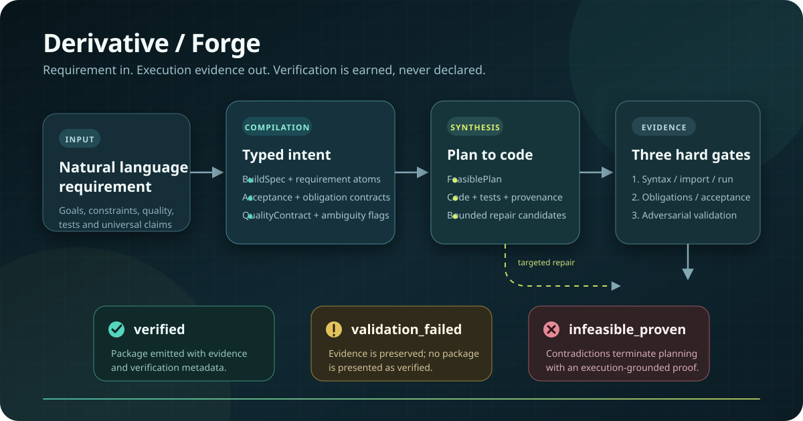
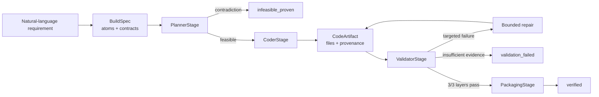
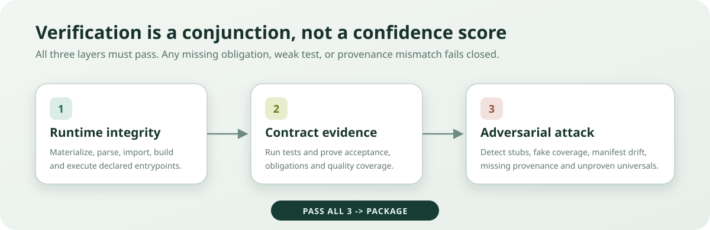

<div align="center">

# Derivative

**Build software from a requirement — and keep the result only if it survives independent verification.**

[](https://github.com/Daniele-Cangi/Derivative/actions/workflows/forge-ci.yml)
[](https://www.python.org/)
[](LICENSE)
[](https://github.com/ai-for-developers/awesome-ai-coding-tools#coding-agents)
[](https://github.com/Daniele-Cangi/Derivative/releases)
[](https://www.codetriage.com/daniele-cangi/derivative)


</div>

<p align="center">
  
</p>

Give Derivative a natural-language software requirement. **Forge** turns it into a structured contract, builds a Python implementation, runs that implementation in an isolated sandbox, and validates the result before packaging it.

The generated code does not get to declare itself correct.

```text
requirement
    ↓
structured contract
    ↓
software
    ↓
isolated execution
    ↓
independent validation
    ↓
verified package
    or
explicit failure evidence
```

[Try it](#quick-start) | [Why it exists](#why-derivative-exists) | [How it works](#how-forge-works) | [Trust model](#trust-model) | [Current scope](#current-scope) | [Evidence](#evidence)

## Example

```bash
python forge.py "Build a Python CLI that reads a CSV of contracts, extracts expiration dates, flags contracts expiring in less than 90 days, writes a summary CSV, and includes tests."
```

Forge does not simply generate a plausible implementation and return it. The candidate must satisfy executable requirements, run successfully inside the sandbox, survive independent checks, and produce enough evidence for packaging.

A run ends in one of three build outcomes:

- **`verified`** — the required runtime, contract, and adversarial gates passed; packaging is allowed.
- **`validation_failed`** — a candidate exists, but the evidence is insufficient; packaging is blocked.
- **`infeasible_proven`** — the stated constraints are contradictory and Forge produced an evidence-backed certificate.

Operational failures such as `sandbox_unavailable` or `sandbox_policy_violation` stop before a build outcome is claimed.

## Why Derivative Exists

Most code-generation systems are optimized to produce an implementation.

Derivative is built around a stricter question:

> **What evidence would justify accepting the generated software?**

That changes the pipeline. Natural-language requirements are preserved as typed obligations, candidate code is executed outside the generator, validation has separate authority, repair is bounded by observed failures, and unsupported claims fail closed instead of being packaged optimistically.

**Derivative** is the broader computational reasoning substrate behind this process. **Forge** is the software-building pipeline that applies it to executable software generation and verification.

## Quick Start

Prerequisites: Python 3.11 and Docker. Docker is required for production verification of generated code.

```bash
python -m venv .venv

# Windows
.venv\Scripts\activate

# macOS/Linux
source .venv/bin/activate

python -m pip install -r requirements/forge.txt
docker build --file Dockerfile.forge-sandbox --tag derivative-forge-sandbox:py311 .
```

Generate and verify a deterministic artifact without an API key:

```bash
python forge.py "Build a Python CLI that reads a CSV of contracts, extracts expiration dates, flags contracts expiring in less than 90 days, writes a summary CSV, and includes tests."
```

Enable model-backed candidate compilation and repair:

```bash
python -m pip install -r requirements/model.txt

# Set OPENAI_API_KEY in .env
python forge.py "Build a Python REST service with tests." --mode hybrid
```

Host credentials are never inherited by generated-code sandboxes.

## What `verified` Means

`verified` does **not** mean formally proven or universally correct.

It means that, at that revision, the generated artifact satisfied the compiled requirement, quality, execution, and adversarial contracts that Forge knew how to check. Independent blind-oracle acceptance is measured separately.

Unsupported or unproven behavior should end as `validation_failed`, never as optimistic packaging.

## How Forge Works


```mermaid
flowchart LR
    R["Natural-language requirement"] --> B["BuildSpec<br/>atoms + contracts"]
    B --> P["PlannerStage"]
    P -->|contradiction| I["infeasible_proven"]
    P -->|feasible| C["CoderStage"]
    C --> A["CodeArtifact<br/>files + provenance"]
    A --> V["ValidatorStage"]
    V -->|targeted failure| X["Bounded repair"]
    X --> A
    V -->|insufficient evidence| F["validation_failed"]
    V -->|3/3 layers pass| K["PackagingStage"]
    K --> O["verified"]
```

The stages have deliberately narrow authority:

- `RequirementCompiler` preserves atomic user intent and compiles acceptance, obligation, public-interface, and quality contracts.
- `PlannerStage` uses the Derivative reasoning substrate to produce a typed plan or an infeasibility certificate.
- `CoderStage` expands that plan through certified capability adapters or an allowlisted complete-candidate transaction.
- `ValidatorStage` executes independent checks; generated code cannot self-certify.
- `PackagingStage` runs only after full validation.

The planner cannot decide truth, the coder cannot decide correctness, and the validator cannot redesign the build.

## Trust Model

Forge is designed to fail closed.

1. **Requirement preservation** — hard, ambiguous, and universal requirements remain traceable from source text to plan, files, tests, assertions, and validation evidence.
2. **Quality contracts** — security, persistence, rate limiting, auditability, observability, and test-depth promises can become executable obligations.
3. **Isolated execution** — production validation runs in an ephemeral Docker container with no network, a read-only root filesystem, resource limits, and an environment allowlist.
4. **Independent validation** — syntax/import/run, obligations/acceptance, and adversarial checks must all pass.
5. **Bounded repair** — retries target observed failure signatures and must produce a material artifact change before revalidation.
6. **Oracle preflight** — incoherent external benchmark harnesses terminate as `oracle_invalid` before Forge or model execution.

<p align="center">
  
</p>

## Derivative and Forge

Derivative and Forge are connected layers, not competing agents.

| Layer | Responsibility |
| --- | --- |
| **Derivative** | Computational lenses, deterministic solvers, obligation compilation, execution grounding, contradiction witnesses, audit, and memory |
| **Forge** | Typed software-build contracts, candidate compilation, independent validation, bounded repair, and fail-closed packaging |

Derivative can ground a plan or prove a contradiction. Only Forge validation evidence can authorize packaging.

Optional model and scientific runtimes load only when the selected mode or problem requires them.

See [Derivative and Forge Architecture Boundary](docs/DERIVATIVE_FORGE_ARCHITECTURE.md).

## Current Scope

### Supported now

- Greenfield Python CLI, REST service, data pipeline, and library artifacts.
- Deterministic capability profiles with model-backed fallback.
- Typed public module and symbol contracts.
- Requirement-level test and assertion evidence.
- Docker-isolated validation and independent black-box benchmark oracles.
- Explicit infeasibility certificates and invalid-benchmark rejection.

### Not claimed

- General existing-repository editing.
- Additional programming languages or frontend generation.
- Formal verification of arbitrary software.
- Universal semantic coverage outside implemented contracts.
- Distribution wheels, runtime containers, SBOMs, or supply-chain attestations.

## Evidence

The [Forge CI run for `b541ec7`](https://github.com/Daniele-Cangi/Derivative/actions/runs/36740655419) passed **711 tests** on Linux/Python 3.11 on September 30, 2026. The workflow also runs the minimal-runtime smoke check and the Docker-backed extended benchmark quality gate.

The project deliberately separates **internal verification** from **external blind acceptance**. Frozen blind benchmarks are never retrospectively rescored after fixes.

The latest frozen blind baseline is **V11**, a schema-4 bundle with 12 cases:

- Status accuracy: **6/12**.
- External Verified@1: **0/6**; none of the six expected-verified cases reached its external oracle.
- All three expected `validation_failed` cases and all three infeasible cases matched their labels.

V5–V11 are known benchmark corpora; post-fix replays are regression evidence, not new blind results. V8-005 is regression-only and must not be reported as new blind evidence. V12 has no published bundle or baseline; its production status is recorded in the benchmark ledger.

The full record — including hashes, denominators, frozen receipts, replay labels, oracle adjudication, and reproduction commands — lives in [Benchmark Evidence](docs/BENCHMARK_EVIDENCE.md).

Blind benchmark authors can also use the [finite infeasibility admission protocol](docs/BLIND_INFEASIBILITY_PROTOCOL.md) for explicit bounded output obligations. It does not allow a private certificate to set Forge's observed result.

## Installation Profiles

Install only the capabilities you need:

| Profile | Purpose |
| --- | --- |
| `requirements/forge.txt` | Minimal deterministic Forge host |
| `requirements/model.txt` | OpenAI-backed candidate compilation and repair |
| `requirements/symbolic.txt` | SymPy symbolic reasoning |
| `requirements/topology.txt` | NetworkX graph reasoning |
| `requirements/formal.txt` | Z3 constraint solving |
| `requirements/probabilistic.txt` | pgmpy probabilistic reasoning |
| `requirements/causal.txt` | DoWhy causal reasoning |
| `requirements/quantum.txt` | Qiskit circuit execution |
| `requirements/physical.txt` | SciPy and Pint physical reasoning |
| `requirements/research.txt` | Complete local Derivative substrate |
| `requirements/dev.txt` | Test tooling |
| `requirements/all.txt` | Complete development environment |

`requirements.txt` remains a compatibility alias for `requirements/all.txt`. A missing selected runtime fails explicitly at its capability boundary.

## CLI and Artifacts

```bash
python forge.py --help
python derivative.py --help
python derivative.py --lenses
python derivative.py --audit
python derivative.py --memory
```

Every Forge run writes typed evidence:

```text
generated_artifacts/
|-- forge_runs/<timestamp>_<build-id>_<status>/
|   |-- build_spec.json
|   |-- feasible_plan.json | infeasibility_certificate.json
|   |-- code_artifact.json
|   |-- validation_artifact.json
|   `-- packaged_artifact.json
`-- forge_packages/<package-id>/
    |-- src/
    |-- tests/
    |-- validation_evidence.json
    |-- code_artifact_manifest_dump.json
    `-- forge_package_manifest.json
```

The CLI reports terminal status, executed stages, validation outcome, artifact path, repair count, trace seal, and elapsed time.

## Development

```bash
python -m pip install -r requirements/all.txt
python -B -m pytest -q -p no:cacheprovider tests
```

Build the sandbox before Docker-backed integration and benchmark runs:

```bash
docker build --file Dockerfile.forge-sandbox --tag derivative-forge-sandbox:py311 .
```

The 30-case internal quality gate is a deterministic regression suite, not independent blind proof:

```bash
python forge_benchmark.py --preset extended \
  --execution-backend docker \
  --sandbox-image derivative-forge-sandbox:py311 \
  --enforce-thresholds \
  --min-status-accuracy 0.95 \
  --min-verified-at-1 0.95 \
  --max-false-verified-rate 0.00 \
  --min-infeasible-detection-rate 1.00
```

Evaluation protocols and replay commands are documented in [Benchmark Evidence](docs/BENCHMARK_EVIDENCE.md).

## Documentation

- [Technical Reference](docs/FORGE_TECHNICAL_REFERENCE.md) — contracts, capabilities, validation, repair, isolation, dependencies, and artifact schema.
- [Benchmark Evidence](docs/BENCHMARK_EVIDENCE.md) — frozen blinds, receipts, metrics, adjudication, and reproducible commands.
- [Architecture Boundary](docs/DERIVATIVE_FORGE_ARCHITECTURE.md) — how Forge and Derivative are interconnected and how loading remains capability-driven.
- [Certified Extension Contract](docs/CERTIFIED_EXTENSION_CONTRACT.md) — requirements for adding a capability without weakening `verified`.
- [Blind V5 Evidence Closure](docs/FORGE_V5_EVIDENCE_CLOSURE.md) — the frozen evidence semantics established at the V5 checkpoint.
- [v0.2.1 Release Notes](https://github.com/Daniele-Cangi/Derivative/releases/tag/v0.2.1) — repair-safety and Qiskit runtime-stability checkpoint.
- [Contributing](CONTRIBUTING.md) — development workflow and acceptance expectations.
- [MIT License](LICENSE) — use and redistribution terms.

## Project Direction

The current phase is deliberately narrow: preserve frozen evidence, correct structural mechanisms rather than known cases, and evaluate the unchanged system on a new blind distribution only after the repair and evidence pipeline is stable.

No new domain, language, frontend, or existing-repository mode is required to close this phase.

## License

Derivative is released under the [MIT License](LICENSE).
